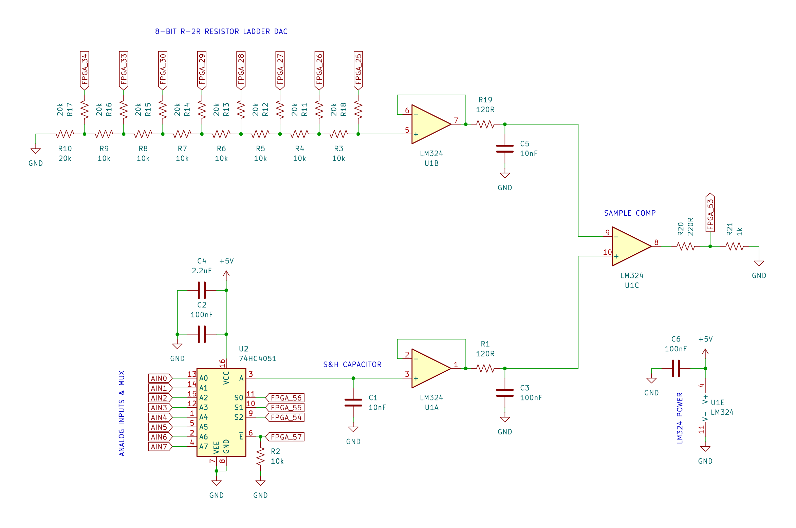

<h1 align="center">Discrete SAR ADC</h1>

	
	  

 

----
While looking at the ADC section of the `RP2350` datasheet last week, I was inspired to design and build my own discrete Successive-Approximation Register (SAR) Analog-to-Digital Converter (ADC). This is the same type of ADC found in the `RP2040`/`RP2350` and many other microcontrollers, where cost and simplicity are more important than accuracy, resolution, or speed.

There are several types of ADC architectures available, each with their own strengths and weaknesses. While doing research for this project, I primarily considered SAR and, later, Delta-Sigma ADCs, ultimately concluding that a SAR ADC would be simpler to build. In retrospect, a dual-slope integrating ADC would also have been easy to implement while offering superior linearity.

Regardless, I made the decision to only use components I already had available to me in an effort to minimize the time to completion of the project.

As designed, this is an 8-bit ADC, though the ENOB will depend on the precision of the resistors in the R-2R DAC, comparator settle time setting (see ADC controller), and other circuit elements and componentry. This ADC is not, and by nature of its discrete design and suboptimal component choices cannot be, a high-precision or high-performance device.

> [!NOTE]
> The full-scale input range of the ADC is 0~3.3V. The upper limit is determined by the DAC reference voltage, which,
> in this case, is equal to the 3.3V IO voltage of the controller FPGA.
>
> The on-board 3.3V regulator of the Tang Nano 9K is not exactly the most stable voltage reference,
> but it is perfectly adequate for an 8-bit ADC.

 

## Successive-Approximation ADC

A detailed explanation of how a typical SAR ADC works can be [found on WikiPedia](https://en.wikipedia.org/wiki/Successive-approximation_ADC).

In a nutshell, it performs a binary search using a DAC and a comparator, successively bringing the output of the DAC closer to the input voltage being measured. The final bit states of the DAC then become the digitized result of the A/D conversion.

 

## Analog Circuitry

    

In the image above, you can see the full circuit diagram of the analog section of the ADC. I soldered all of these components onto a small perfboard (images TBD after some cleanup), with flat flex wires and headers going off-board to connect to the digital ADC controller (`GW1NR-LV9` FPGA on a Tang Nano 9K).

> [!NOTE]
> The `74HC4051` I used is on a small carrier module. Its decoupling capacitor and EN pin pull-down resistor are both on that module, not on my perfboard.

The only reason I used a `74HC4051` analog multiplexer was that I did not have another analog switch suitable for use as a sample-and-hold switch, though as a benefit of using a multiplexer, the ADC now has 8 input channels, which can be selected by the host over I²C.

An N-MOSFET/P-MOSFET pair can also be used as an analog switch; however, I did not have an appropriate set in stock.

> [!NOTE]
> The voltage follower at the output of the DAC and the one at the output of the mux are not particularly useful, seeing as their outputs feed into another op-amp (the `LM324-N` is a quad op-amp IC) with the exact same input characteristics.

### Sample & Hold

Generally speaking, in real ADC designs, a sample-and-hold capacitor and switch are utilized to ensure that the voltage being measured by the ADC does not change during conversion. Depending on the ADC architecture, it may also assist with meeting input impedance requirements.

To that end, although arguably unnecessary for an educational ADC, I implemented a sample-and-hold block. The `74HC4051` acts as the switch, made possible thanks to its enable pin, which, when high, will open all eight internal mux switches. The sample-and-hold capacitor is a 10nF MLCC.

> [!NOTE]
> Real-world testing showed that disabling sample-and-hold (leaving the mux enabled at all times) can increase conversion accuracy.
>
> There appears to be a small amount of leakage current (in the order of tens of nanoamperes, based on my calculations) through either the mux or the
> input of the buffer op-amp, which causes the sample-and-hold capacitor to either charge or discharge (seemingly depending on its voltage) slowly, over
> the course of the conversion.
>
> The effect of the leak can be somewhat minimized by increasing the conversion speed of the ADC, though for inputs with low dV/dt,
> I recommend completely disabling sample-and-hold.
>
> Alternatively, a larger sample-and-hold capacitor can also partially remediate this issue.

### Digital-to-Analog Converter

As discussed before, a SAR ADC internally requires a DAC, whose resolution will determine the resolution of the ADC.

As with ADCs, there are a few different DAC architectures that are commonly used. I chose an R-2R resistor ladder DAC, as it is the simplest one to build, only requiring two resistor values (R and 2*R, 10k and 20k in my design).

R-2R DACs often suffer from poor linearity as a result of variations in the values of the resistors used to create them. For our purposes, this is an acceptable limitation.

In all honesty, I am not sure what tolerance the resistors I used have, as I purchased them a very long time ago, and SMD resistors do not carry tolerance markings.

I have connected the output pins of the FPGA directly to the DAC bit resistors. This can cause minor inaccuracies due to the on-resistances of the FPGA output pins, but those are insignificant compared to the series 20k resistors of the DAC.

### Sample Comparator

Unfortunately, I did not have any dedicated comparators in stock; as such, I was left with no choice but to use an op-amp as a comparator (specifically, the `LM324-N`). This is generally not recommended, as op-amps are not designed for open-loop operation, and they are much slower than dedicated comparators.

However, as this is not a serious project with any particular operational requirements, this is perfectly fine.

 

## ADC Controller

Around two years ago, I purchased a Sipeed Tang Nano 9K FPGA development board, featuring a Gowin `GW1NR-LV9` FPGA. Since then, I have not once used it in a project, so when building this ADC, I decided to implement all of the control logic using an FPGA.

This is the first time I have worked with an FPGA and the first time I've written Verilog; as such, my Verilog design is likely sub-optimal. Regardless, this has been a highly educational endeavor.

For more details, you can find all of the Verilog source files in [`sar_adc_controller/src`](sar_adc_controller/src). I used the Gowin EDA for development and synthesis. You can find setup instructions on [Sipeed's wiki page](https://wiki.sipeed.com/hardware/en/tang/Tang-Nano-9K/Nano-9K#Getting-Started).

 

## Host Interface (I²C)

A host microcontroller can communicate with the ADC control FPGA over an I²C register interface. I am using the [I2C Slave IP core from OpenCores](https://opencores.org/projects/i2cslave). A number of configuration registers can also be accessed over I²C.

The I²C slave address is set to `0x3c` by default, though it can be changed in [`i2c_slave/i2cSlave_define.v`](sar_adc_controller/src/i2c_slave/i2cSlave_define.v). I have tested the I²C interface at up to a maximum speed of 1 MHz (Fast-mode Plus) without any issues.

> [!NOTE]
> By default, pins `41` and `42` of the FPGA are `SDA` and `SCL`, respectively.

### Register Map

| Address | R/W | Function                                | Reset Value   |
| ------- | --- | --------------------------------------- | ------------- |
| `0x00`  | R/W | status and command register write mask  | `8'b00000000` |
| `0x01`  | R/W | status and command register (see below) | `8'b10100000` |
| `0x02`  | R/W | S&H sample clocks count                 | `255`         |
| `0x03`  | R/W | sample comparator settle clocks count   | `255`         |
| `0x04`  | R/W | ADC clock divisor register low byte     | `8'b11111111` |
| `0x05`  | R/W | ADC clock divisor register high byte    | `8'b00000001` |
| `0x06`  | R   | ADC conversion result register          | `0`           |

> [!NOTE]
> Registers `0x02` and `0x03` are in terms of ADC clock counts. The ADC clock speed can be set as a division of the system clock (provided by the 27MHz crystal on the Tang Nano 9K) using registers `0x04` and `0x05`.
>
> It is worth mentioning, though, that the ADC clock is technically not a separate clock domain at all. It is simply an enable signal which is asserted every `n` system clocks, `n` being the ADC clock divisor. Internally, that enable signal is used to control the execution of ADC-related functions.

### Status & Command Register

| Bit | R/W | Function                                |
| --- | --- | --------------------------------------- |
| `0` | R/W | input mux select bit `0`                |
| `1` | R/W | input mux select bit `1`                |
| `2` | R/W | input mux select bit `2`                |
| `3` | W   | request new conversion signal           |
| `4` | R/W | conversion done signal                  |
| `5` | R/W | enable sample-and-hold functionality    |
| `6` | W   | reset ADC controller                    |
| `7` | R/W | enable conversion done pin output       |

> [!NOTE]
> Bits `3` and `6` do not respect the write mask as they are one-shot (write `1` to trigger) signals.

> [!NOTE]
> The conversion done flag (bit `4`) can be cleared by writing a `0` to it.

> [!NOTE]
> Pin `51` of the FPGA is the conversion done pin. It is an active-low open-drain pin.

 

## Contact

You can contact me via e-mail.\
E-mail: [samyarsadat@gigawhat.net](samyarsadat@gigawhat.net)

 

----
Copyright © 2026 Samyar Sadat Akhavi.\
Written by Samyar Sadat Akhavi, 11/08/2026.
